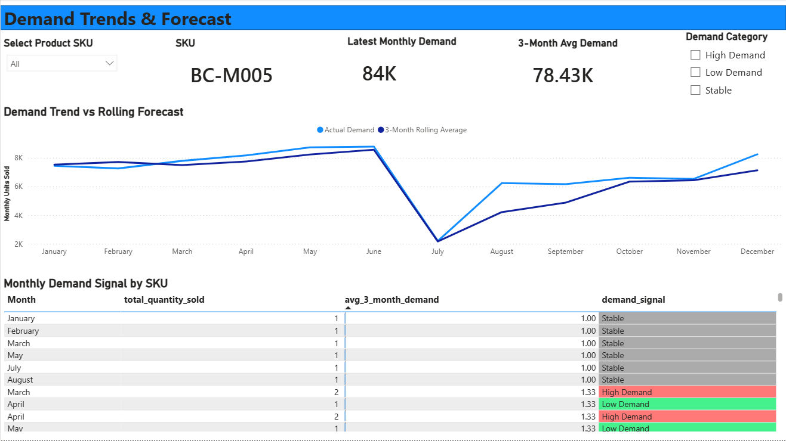
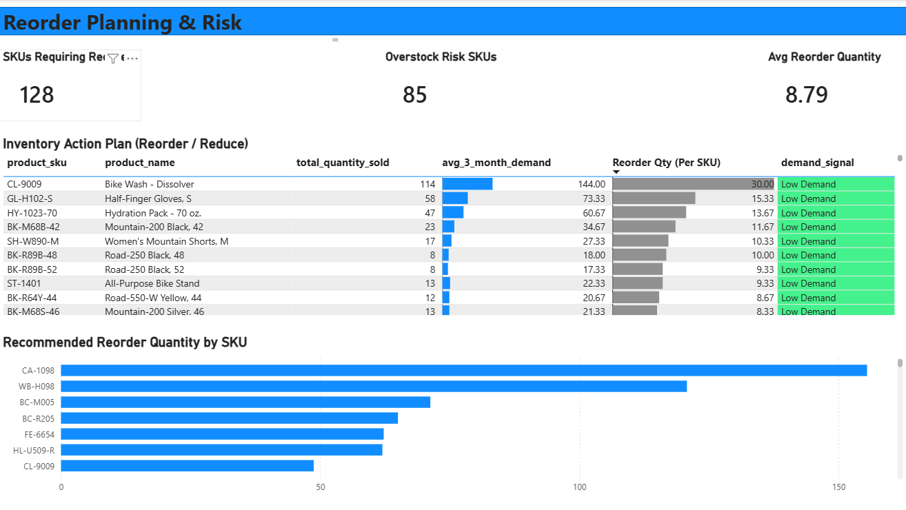
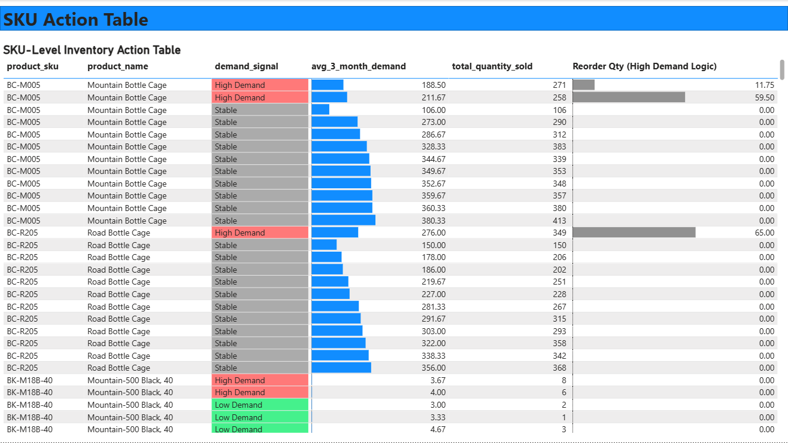

<p align="center">
  
  
  
  
</p>

---

# 📊 Inventory Demand Forecasting & Reorder Planning Dashboard
End-to-end inventory demand analysis and reorder planning using SQL, Power BI, and DAX

---

## 📁 Project Overview

This project focuses on analyzing product-level demand patterns and building an inventory planning system to support data-driven reorder decisions.

Using historical sales data, I classified products into demand categories (High, Stable, Low), calculated rolling demand trends, and developed reorder quantity logic to identify SKUs requiring immediate action.

The final output is a multi-page Power BI dashboard designed for operations and inventory teams to monitor demand trends, forecast future needs, and reduce stockout or overstock risk.

---

## ❓ Business Questions Answered

- How many SKUs are currently high demand, stable, or low demand?
- Which products require immediate reorder action?
- How does actual monthly demand compare to rolling demand forecasts?
- Which SKUs are at risk of overstock or understock?
- What is the recommended reorder quantity per SKU based on demand signals?

---

## 🛠 Tools & Technologies

- SQL (PostgreSQL): Data modeling, aggregation, and demand signal logic
- Power BI: Dashboard development and visualization
- DAX: KPI calculations, rolling averages, and reorder logic
- GitHub: Version control and project documentation

---

## 🧱 Dataset & Data Model

The analysis is based on a relational sales database containing:

- fact_sales: order-level sales transactions
- dim_product: product attributes and pricing information

Key modeling steps:
- Aggregated monthly demand at the SKU level
- Calculated rolling 3-month average demand
- Classified demand signals (High / Stable / Low)
- Created SQL views optimized for Power BI reporting

---

## 📁 Project Structure
```
inventory-demand-forecasting-powerbi/
│
├── sql/
│   ├── inventory_demand_signals.sql
│
├── powerbi/
│   └── inventory_demand_dashboard.pbix
│
├── screenshots/
│   ├── inventory_overview.png
│   ├── demand_trends_forecast.png
│   ├── reorder_planning_risk.png
│   └── sku_action_table.png
│
└── README.md
```
---

## 📊 Dashboard Included
### **1️⃣ Inventory Overview**
- Total SKUs Tracked
- High Demand Products
- Low Demand Products
- Stable Products
- Products by Demand Category
- Monthly Demand Trend
- Products Requiring Inventory Action

### **2️⃣ Demand Trends & Forecast**
- Latest Monthly Demand (KPI)
- 3-Month Average Demand (KPI)
- 3-Month Average Demand (KPI)
- Monthly Demand Signal by SKU
- SKU & Demand Category slicers

### **3️⃣ Reorder Planning & Risk**
- SKUs Requiring Reorder (KPI)
- Overstock Risk SKUs (KPI)
- Average Reorder Quantity (KPI)
- Inventory Action Plan (Reorder / Reduce)
- Recommended Reorder Quantity by SKU

### **4️⃣ SKU-Level Inventory Action Table**
- SKU-level demand classification
- Rolling demand metrics
- Total quantity sold
- Reorder quantity logic (High Demand only)
- Conditional formatting for demand signals

---

## 🧮 Key DAX Measures
```
Total SKUs Tracked =
DISTINCTCOUNT('Inventory Demand Signals'[product_sku])


High Demand Products =
CALCULATE(
    DISTINCTCOUNT('Inventory Demand Signals'[product_sku]),
    'Inventory Demand Signals'[demand_signal] = "High Demand"
)


Low Demand Products =
CALCULATE(
    DISTINCTCOUNT('Inventory Demand Signals'[product_sku]),
    'Inventory Demand Signals'[demand_signal] = "Low Demand"
)


Stable Products =
CALCULATE(
    DISTINCTCOUNT('Inventory Demand Signals'[product_sku]),
    'Inventory Demand Signals'[demand_signal] = "Stable"
)


Latest Monthly Demand =
CALCULATE(
    SUM('Inventory Demand Signals'[total_quantity_sold]),
    LASTDATE('Inventory Demand Signals'[sales_month])
)


3-Month Avg Demand =
AVERAGE('Inventory Demand Signals'[avg_3_month_demand])


Reorder Qty (High Demand Logic) =
VAR ForecastDemand =
    SUM('Inventory Demand Signals'[avg_3_month_demand])
VAR SafetyStock =
    ForecastDemand * 0.5
VAR TargetInventory =
    ForecastDemand + SafetyStock
VAR CurrentDemand =
    SUM('Inventory Demand Signals'[total_quantity_sold])
RETURN
MAX(TargetInventory - CurrentDemand, 0)


Avg Reorder Quantity =
AVERAGEX(
    VALUES('Inventory Demand Signals'[product_sku]),
    [Reorder Qty (High Demand Logic)]
)

```
---

## 🚀 How to Run This Project

You can either explore the Power BI dashboard directly or recreate the full SQL → Power BI pipeline.

### ✅ Option 1 – Open the Power BI report only

1. Download `inventory_demand_dashboard.pbix` from this repository.
2. Open it using Power BI Desktop.
3. If the data connection fails:
  -You can still explore the existing visuals, or
  -Re-point the data source to your own PostgreSQL database.

---

### ✅ Option 2 – Rebuild the full SQL + Power BI pipeline
1. **Create a PostgreSQL database:**
```sql
CREATE DATABASE inventory_analytics;
```

2. **Create base tables (or reuse existing ones)**

```sql
fact_sales
dim_product
```

3. **Run the SQL scripts included in the /sql folder to create reporting views:**

```sql
inventory_demand_signals.sql
```

These views:
- Aggregate monthly demand at SKU level
- Calculate rolling 3-month average demand
- Classify demand signals (High / Stable / Low)

4. **Open the Power BI file and connect it to the PostgreSQL views.**

5. **Refresh data to load demand trends, forecasts, and reorder calculations.**
---

## 📸 Dashboard Screenshots

Here are the key pages from the Power BI dashboard included in this project.

### **Inventory Overview**


---

### **Demand Trends & Forecast**



---

### **Reorder Planning & Risk**



---

### **SKU Action Table**



---

## 📈 Key Insights & Findings

A summary of the most important operational insights discovered through inventory demand analysis and reorder planning.

### 🔹 1. Demand Distribution & SKU Coverage
- The inventory consists of 130 unique SKUs across all products.
- 98%+ of SKUs show High or Stable demand patterns, indicating consistently active inventory.
- Only ~65% of SKUs fall under Low Demand, highlighting potential overstock and capital lock-up risk.

### 🔹 2. Monthly Demand Trends
- Monthly demand remained relatively stable for most of the year, with a sharp dip in mid-year, followed by recovery.
- The 3-month rolling average demand closely follows actual sales, smoothing short-term volatility and improving forecasting reliability.
- Demand in peak months was 3–4× higher than low-volume months, indicating seasonal purchasing behavior.

### 🔹 3. High-Demand Product Insights
- 128 SKUs were classified as High Demand, requiring active inventory replenishment.
- High-demand SKUs consistently sold 20–40% above their rolling average, signaling sustained growth rather than short-term spikes.
- These SKUs account for the majority of total units sold and represent the highest stock-out risk.

### 🔹 4. Low-Demand & Overstock Risk
- 85 SKUs were identified as Low Demand, indicating potential overstock risk.
- Several low-demand SKUs showed reorder requirements below 10 units, suggesting that further purchasing may be unnecessary.
- Overstock-risk products tie up inventory capital without proportional sales contribution.

### 🔹 5. Reorder Planning & Inventory Action
- The average recommended reorder quantity across SKUs was ~8–9 units, balancing demand coverage and safety stock.
- High-demand SKUs required 2–6× higher reorder quantities compared to low-demand products.
- A safety stock buffer of 50% of forecasted demand helped prevent under-ordering while avoiding excessive stock buildup.

### 🔹 6. Business Impact & Decision Support
- The dashboard enables SKU-level inventory decisions rather than category-level assumptions.
- Demand classification simplifies operational planning for:
  - Reorder prioritization
  - Overstock risk identification
  - Inventory cost control
- This approach can significantly reduce:
  - Stock-outs for high-demand items
  - Excess inventory holding costs

## 📬 Contact

If you’d like to discuss this project, collaborate, or have feedback, feel free to reach out:

- LinkedIn: [NURA ALAM SHOHAG](https://www.linkedin.com/in/dataanalystshohag/)  
- GitHub: [Shohag-DataAnalyst](https://github.com/Shohag-DataAnalyst)

